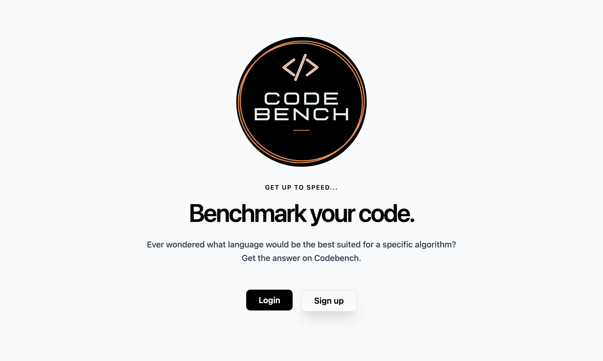
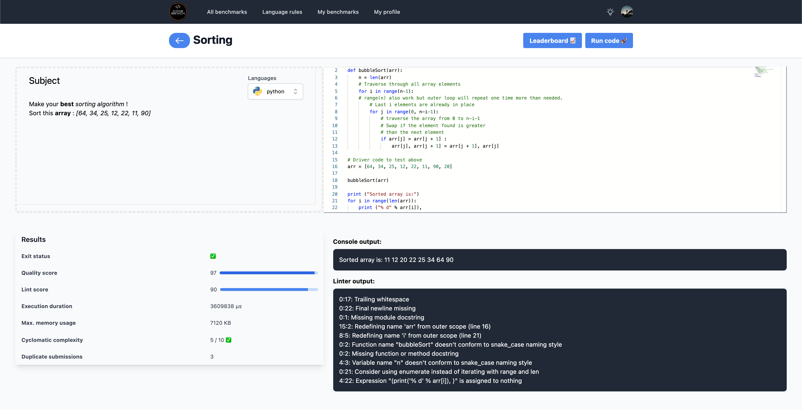

# Codebench front

This is the React frontend for Codebench.

## Requirements

- Node 14
- [The Codebench API](https://github.com/codebench-dev/api)

## Notable libraries used

The project was bootstraped by [react-start-app](https://github.com/facebook/create-react-app)

- [monaco-editor](https://github.com/suren-atoyan/monaco-react)
- [tailwindcss](https://tailwindcss.com/)
- [react-router](https://github.com/ReactTraining/react-router)
- [react-query](https://github.com/tannerlinsley/react-query)

## Screenshots

